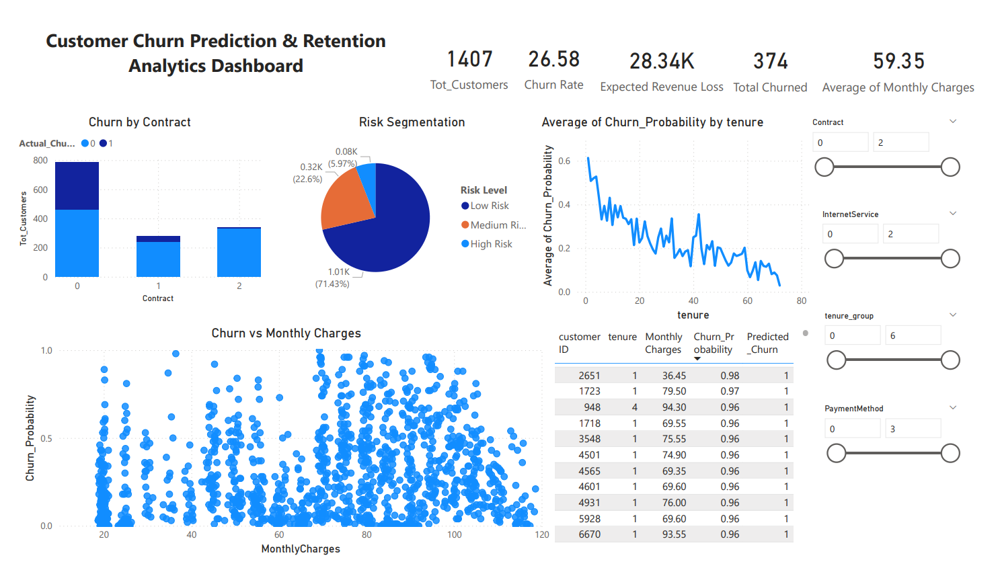

# AI-Powered Customer Churn Prediction & Retention Analytics

## Project Overview

Customer churn is a critical problem for subscription-based businesses such as telecom companies. This project builds a **machine learning pipeline to predict customer churn** and provides **actionable analytics through a Power BI dashboard**.

The system analyzes customer behavioral and billing features to identify **high-risk customers**, estimate **potential revenue loss**, and enable **data-driven retention strategies**.

---

## Objectives

* Predict the likelihood of customer churn using machine learning models.
* Identify key factors influencing churn.
* Segment customers into risk categories based on churn probability.
* Provide business insights through an interactive Power BI dashboard.

---

## Dashboard Preview



The dashboard provides a comprehensive view of churn analytics including:

* Total Customers
* Churn Rate
* Expected Revenue Loss
* Risk Segmentation
* Churn vs Monthly Charges
* Churn Probability Trends by Tenure
* High-Risk Customer Identification

---

## Machine Learning Pipeline

The project follows a complete machine learning workflow:

1. **Data Collection**

   * IBM Telco Customer Churn Dataset

2. **Data Preprocessing**

   * Handling missing values
   * Label encoding for categorical variables
   * Feature transformation

3. **Exploratory Data Analysis (EDA)**

   * Churn distribution analysis
   * Feature correlations
   * Behavioral insights

4. **Feature Engineering**

   * Tenure grouping
   * Derived billing metrics

5. **Model Training**

   * Train-test split
   * Classification models for churn prediction

6. **Model Evaluation**

   * Accuracy
   * Precision / Recall
   * Churn probability estimation

7. **Prediction Export**

   * Generate churn probability for each customer
   * Export predictions for Power BI analytics

---

## Power BI Analytics Dashboard

The Power BI dashboard visualizes churn insights and business metrics:

### Executive Metrics

* **Total Customers**
* **Churn Rate**
* **Expected Revenue Loss**
* **Average Monthly Charges**

### Customer Risk Analytics

* Risk segmentation (Low / Medium / High)
* Churn probability trends
* High-risk customer identification

### Behavioral Insights

* Churn vs Monthly Charges
* Churn by Contract Type
* Churn probability by tenure

These insights help organizations **identify churn patterns and design targeted retention strategies**.

---

## Installation

Clone the repository:

```bash
git clone https://github.com/yourusername/customer-churn-prediction-analytics.git
cd customer-churn-prediction-analytics
```

Install required dependencies:

```bash
pip install -r requirements.txt
```

---

## Usage

1. Open the Jupyter notebook:

```
notebooks/Customer_Churn_Prediction.ipynb
```

2. Run the notebook to:

* preprocess the dataset
* train the machine learning model
* generate churn probability predictions

3. Export predictions for dashboard visualization.

4. Open the Power BI file:

```
dashboard/CustomerChurnPrediction.pbix
```

to explore interactive analytics.

---

## Dataset

The project uses the **IBM Telco Customer Churn Dataset**.

Features include:

* Customer tenure
* Contract type
* Internet service
* Payment method
* Monthly charges
* Total charges
* Churn label

Dataset size: **7,000+ customers**

---

## Tech Stack

**Programming & Data Processing**

* Python
* Pandas
* NumPy

**Machine Learning**

* Scikit-Learn

**Visualization**

* Matplotlib
* Seaborn
* Power BI

**Development Tools**

* Google Colab
* Jupyter Notebook
* GitHub

---

## Key Insights

* Month-to-month contract customers show the **highest churn risk**.
* Customers with **higher monthly charges** are more likely to churn.
* **Short-tenure customers** exhibit higher churn probability.
* Risk segmentation helps businesses prioritize **retention strategies for high-risk customers**.

---

## Future Improvements

Potential enhancements for this project:

* Deploy the model using **FastAPI or Flask**
* Build a **real-time churn prediction API**
* Add **Explainable AI (SHAP)** for churn explanation
* Implement **deep learning models for churn prediction**
* Develop a **web dashboard using Streamlit**

---

## Author

**Prathish A**

---

## If you found this project useful

Consider **starring the repository** to support the project!
